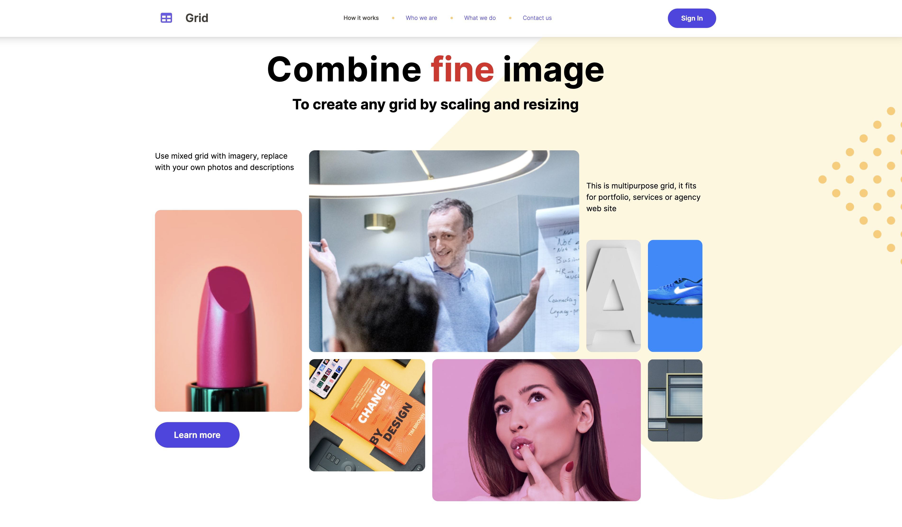

# Website Landing page design with React and Tailwind CSS 🌦

 

This project is a web page implementation created with React and Tailwind CSS, adhering to the design provided in a Figma prototype. I was not involved in the design process but translated the design into code based on the provided design specifications.

## Tech Stack

- **React**
- **Tailwind CSS**
- **HTML**
- **CSS**
